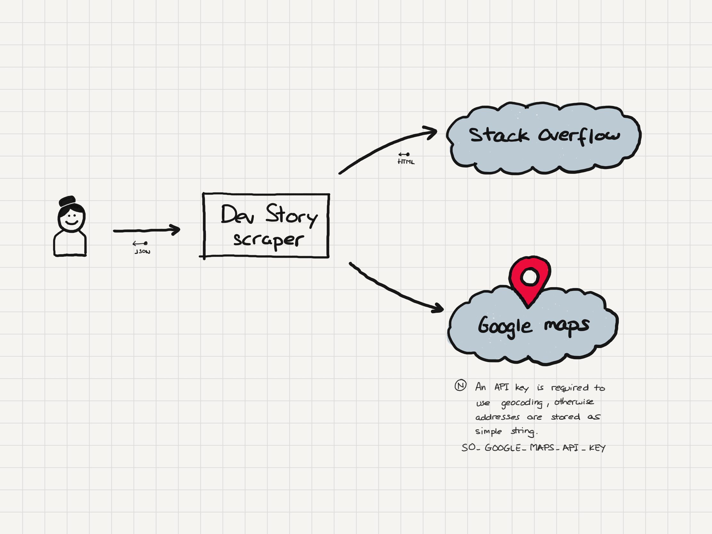
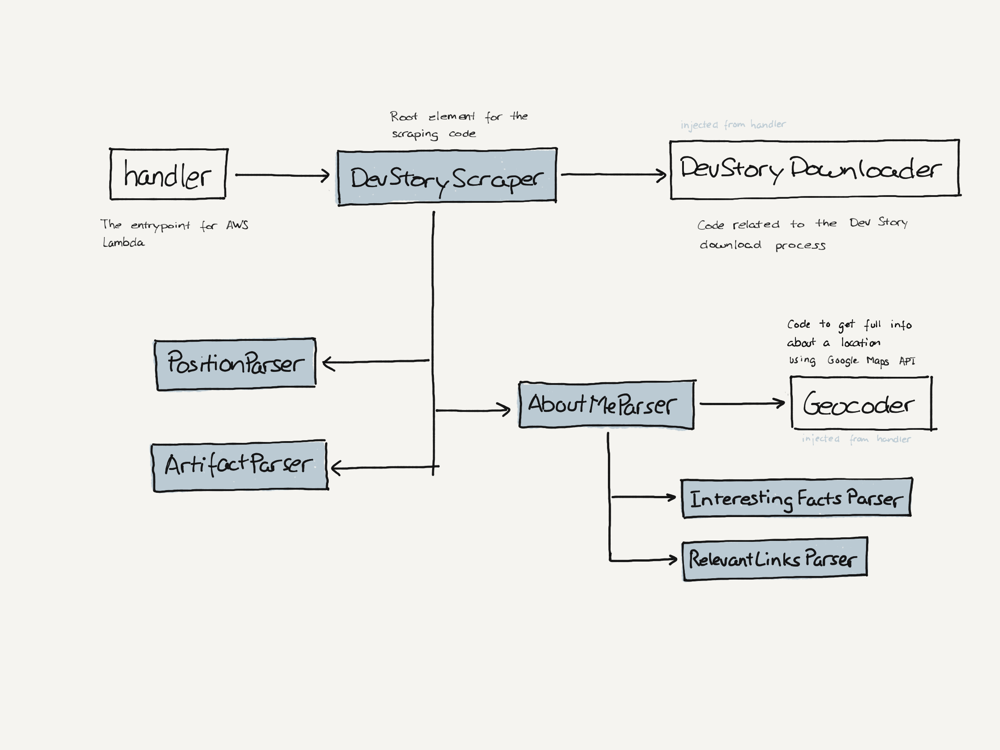
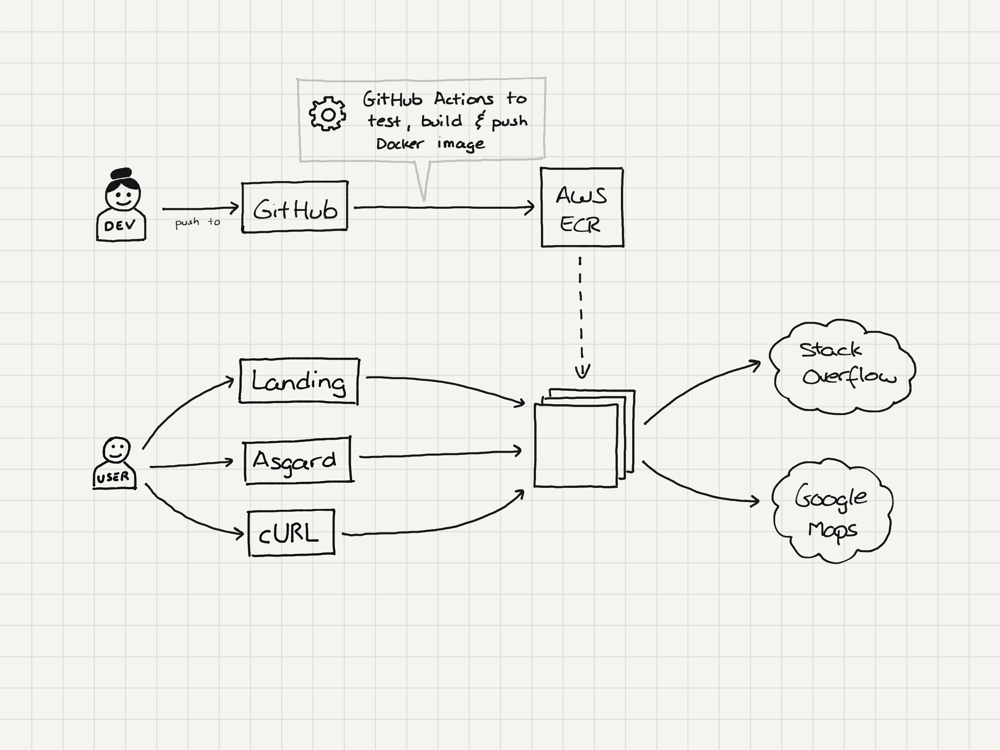

# Stack Overflow Dev Story scraper

> This tool downloads a Dev Story (from Stack Overflow) into a JSON compliant with Manfred's MAC JSON schema.

## General overview

The project is pretty simple and it is prepared to be deployed as an AWS Lambda function.

The only dependency is with Google Maps API, but if no API Key for Google is provided it just don't autocomplete the field `whereILive`.

## Code

The scraping process is designed to follow the MAC JSON schema, so each main subdocument is a parser on its own.

The `index.ts` file contains the handler that launches the Lambda function, and it is in charge of the bootstraping initializing the required depdencies.

The `DevStoryDownloader` and `Geocoder` are created at the beginning so we can inject a mock for test purposes, avoiding overusing the Stack Overflow or Google's systems.

### Tasks

* `yarn install`: Installs all the required dependencies
* `yarn test`: Launches the test suite
* `yarn build`: Transpilation process from TS to JS

## Deployment

We deploy the code at AWS Lambda using GitHub Actions. There are some details we need to take care of, though.
* The default timeout of a lambda is 3 seconds, and it is too slow for larger dev stories. It is better to increase up to 10 seconds.
* By default the log level is `info` we can change it with environment variable `LOG_LEVEL`.
* **We need to configure the `GOOGLE_MAPS_API_KEY` to use the  geocoder**.

## Design decisions

To adapt the scraped data to the MAC JSON Schema we took some design decisions.

### Name to name and surnames

Stack Overflow uses just a name, to create `name` and `surnames` fields we decided to use the first word as name and the rest as surnames.

### Location completion

Location is a free field, so we are using Google Maps API to get more data. `whereILive` field is composed by `country`, `region`, and `municipality` but usually SO only has 2 of those fields.

Examples:
* Tampa, Florida > Tampa, Florida, US
* Madrid, Spain > Madrid, Community of Madrid, ES

TBD - special cases and error handling
