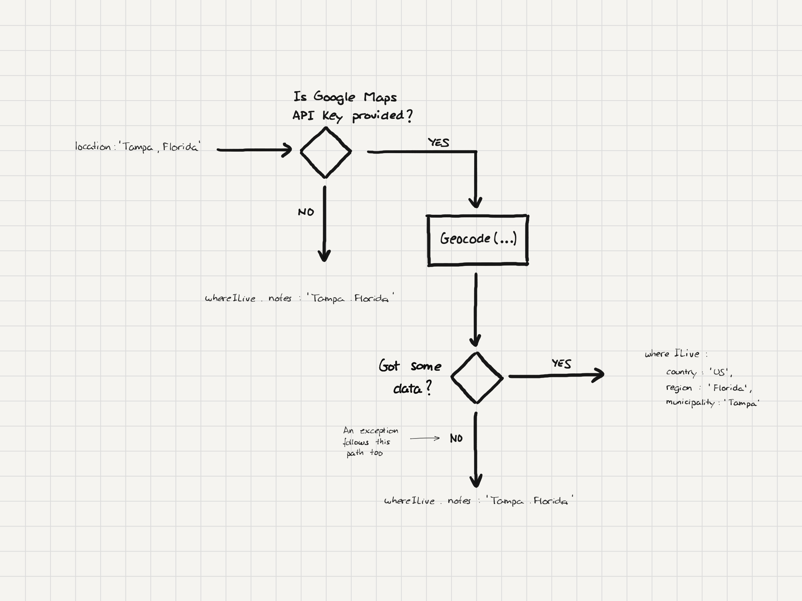

<div align="center">

# StackOverflowgeddon Survival Kit<br />(Developer Stories Scraper)

With this code, you will _survive_ ["the StackOverflowgeddon"](https://www.getmanfred.com/stackoverflowgeddon), the discontinuation of the «Developer Story» feature on Stack Overflow, which means that more than 4 million people will lose the professional data forever. **This script scraps and downloads your data contained in a Dev Story (using its public URL) as a JSON file**, compliant with the open-source MAC (Manfred Awesomic CV) format.
<br />
<br />
[General Overview](#general-overview) •
[How to run](#how-to-run) •
[Code](#code) •
[Deployment](#deployment) •
[Why](#why) •
[Who we are](#who-we-are) •  
[License](#license) •
[Spread the word !!! 🖖](#-spread-the-word)
<br />
<br />
<a href='https://www.getmanfred.com/stackoverflowgeddon'>
  
</a>
  
</div>

## General Overview

The only dependency is with Google Maps API. If no key for Google Maps API is provided it just doesn't autocomplete the field `whereILive`. In that case the location information from the Dev Story is stored at `aboutMe.profile.whereILive.notes`.


## How to run

### Plain Node.js

```shell
yarn install

yarn build

yarn start

curl http://localhost:3000\?username\=<Dev Story username>
```

### Docker

```shell
docker build . -t username/dev-story-scraper

docker run -p3000:3000 -d username/dev-story-scraper

# If you have a Google Maps API
docker run -p3000:3000 -e SO_GOOGLE_MAPS_API_KEY=<key value> -d username/dev-story-scraper
```

## Code


The scraping process is designed to follow the [MAC JSON schema](https://github.com/getmanfred/mac) structure independently from the position at the Stack Overflows HTML. So each "large" sub-document at the JSON Schema usually have its own parser class.

The `DevStoryDownloader` and `Geocoder` are created at the beginning so we can inject a mock for test purposes, avoiding overusing the Stack Overflow or Google's systems, this also prevents false red tests. We could use the dependency injection in better ways, but for a project that is going to be used for a few days and discarded it doesn't worth the price.

## Deployment


**We need to configure the `GOOGLE_MAPS_API_KEY` to use the geocoder**.

## Design decisions

To adapt the scraped data to the [MAC JSON Schema](https://github.com/getmanfred/mac) we took some design decisions.

### Name to name and surnames

Stack Overflow uses just a string with full name, to create `name` and `surnames` fields we decided to use the first word as name and the rest as surnames.

Example:

```
{
  name: 'Ryan Reynolds'
}
```

to

```
{
  name: 'Ryan',
  surnames: 'Reynolds'
}
```

### Location completion

Location is a free field, so we are using Google Maps API to get more data. `whereILive` field is composed by `country`, `region`, and `municipality` but usually a Dev Story only has 2 of those fields.

Examples:
* Tampa, Florida > Tampa, Florida, US
* Madrid, Spain > Madrid, Community of Madrid, ES



### Job parsing


### Assessment parsing


### Stack Overflow top answers parsing


## Why

We were committed to building an open platform to manage careers during 2022, including online CVs. Then, we knew [Stack Overflow had decided to sunset the Developer Stories](https://meta.stackoverflow.com/questions/415293/sunsetting-jobs-developer-story) (a kind of... online CVs), and that meant that more **than 4 million developers would lose their professional data forever**.

So, we thought `"what if we hustle to get at least a subset of what we wanted to build in 6 months in just 2 to give those people a way to preserve their data?"`. The rest is history.

1. First, we defined an open-source CV format: the [MAC](https://github.com/getmanfred/mac)
2. Second, we created a tool to recover and store your data from your Dev Story —as a MAC compliant JSON file— available through [a landing page](https://stage.getmanfred.com/stackoverflowgeddon). The code running behind it is what you have in this repo.
3. Third, we improved [our online CV platform](https://www.getmanfred.com/) to import (if wanted) data from Dev Stories easily.

## Who we are

The Kit was made with ❤️ and care by the [Manfred](https://www.getmanfred.com/) team.

We are a bunch of developers trying to create **a better approach to technical talent recruiting**. This is our manifesto:

<a href='https://www.getmanfred.com/'>
  
</a>

## License

This code is free and open-source software licensed and distributed under the Creative Commons Attribution Share Alike 4.0 International (CC BY-SA 4.0 International).

## 🌟 Spread the word!

If you want to say thank you and/or support active development of the Kit:

- Add a GitHub Star to the project!
- Tweet about the project on your Twitter!
  - Tag [@getmanfred](https://twitter.com/getmanfred) and/or `#stackoverflowgeddon`

Thanks so much for your interest in growing the reach of this initiative!
