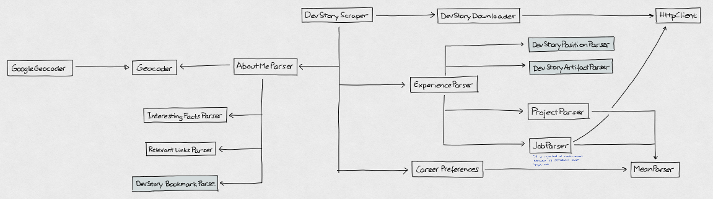

# Stack Overflow Dev Story scraper

This project is able to download a dev story from a given username and then scrape the information. The result is a JSON object compliant with Manfred's JSON Schema for a MAC.

## Code

### Tasks

* `yarn install`: Installs all the required dependencies
* `yarn test`: Launches the test suite
* `yarn build`: Transpilation process from TS to JS

## Deployment

We deploy the code at AWS Lambda using GitHub Actions. There are some details we need to take care of, though.
* The default timeout of a lambda is 3 seconds, and it is too slow for larger dev stories. It is better to increase up to 10 seconds.
* By default the log level is `info` we can change it with environment variable `LOG_LEVEL`.
