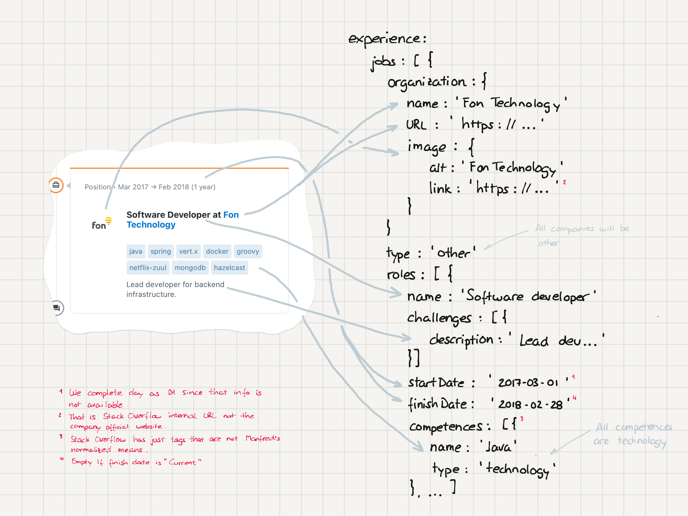

# Stack Overflow Dev Story scraper

> This tool downloads a Dev Story (from Stack Overflow) into a JSON compliant with Manfred's MAC JSON schema.

## General overview


The only dependency is with Google Maps API. If no key for Google Maps API is provided it just doesn't autocomplete the field `whereILive`. In that case the location information from the Dev Story is stored at `aboutMe.profile.whereILive.notes`.

## How to run

### Plain Node.js

```shell
yarn install

yarn build

yarn start

curl http://localhost:3000\?username\=<Dev Story username>
```

### Docker

```shell
docker build . -t username/dev-story-scraper

docker run -p3000:3000 -d username/dev-story-scraper

# If you have a Google Maps API
docker run -p3000:3000 -e SO_GOOGLE_MAPS_API_KEY=<key value> -d username/dev-story-scraper
```

## Code


The scraping process is designed to follow the MAC JSON schema structure independently from the position at the Stack Overflows HTML. So each "large" sub-document at the JSON Schema usually have its own parser class.

The `index.ts` file contains the handler that launches the Lambda function, and it is in charge of the bootstraping process.

The `DevStoryDownloader` and `Geocoder` are created at the beginning so we can inject a mock for test purposes, avoiding overusing the Stack Overflow or Google's systems, this also prevents false red tests. We could use the dependency injection in better ways, but for a project that is going to be used for a few days and discarded it doesn't worth the price.

## Deployment


**We need to configure the `GOOGLE_MAPS_API_KEY` to use the  geocoder**.

## Design decisions

To adapt the scraped data to the MAC JSON Schema we took some design decisions.

### Name to name and surnames

Stack Overflow uses just a string with full name, to create `name` and `surnames` fields we decided to use the first word as name and the rest as surnames.

Example:

```
{
  name: 'Ryan Reynolds'
}
```

to

```
{
  name: 'Ryan',
  surnames: 'Reynolds'
}
```

### Location completion

Location is a free field, so we are using Google Maps API to get more data. `whereILive` field is composed by `country`, `region`, and `municipality` but usually a Dev Story only has 2 of those fields.

Examples:
* Tampa, Florida > Tampa, Florida, US
* Madrid, Spain > Madrid, Community of Madrid, ES


### Job parsing



### Assessment parsing


### Stack Overflow top answers parsing


